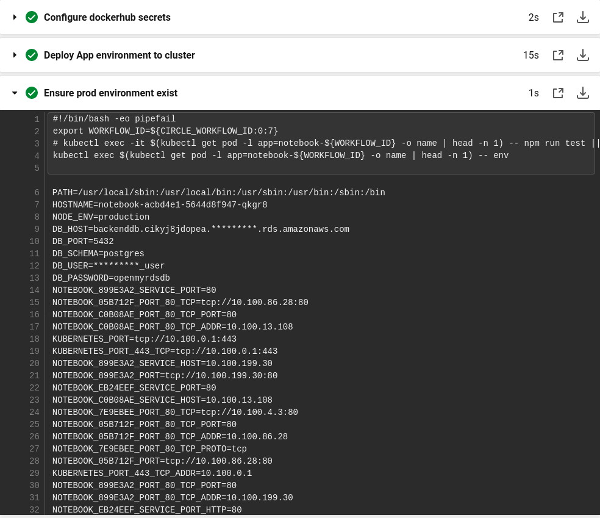

# cicd-kubernetes

# Solution Overview

Use Case: 

A Blue/Green deployment using two `build and deploy` run of the pipeline.

The Blue environment will be the previous Workflow in Circleci pipeline and the Green environment is the current Workflow.

A load balancer is used as the frontend for user access to the kubernetes pods running the App in the cluster.

Promotion to the Green environment happens when an ingress is applied to the load balancer switching traffic from the previous Workflow pod instances to the current Workflow instances.

Circleci pipeline:

`build-app` : CI job dockerrize the nodejs App and push to Dockerhub registry after passing tests

`deploy-infrastructure` : 

CD deployment environment job to setup AWS EKS cluster infrastructure using AWS cloudformation `templates/cluster.yaml`

If the AWS EKS cluster is fully deployed, disable this job with Circleci pipeline parameter `run_deploy_infrastructure` set to `false`.

This Circleci job is equivalent to setting up the `deployment environments` in the `Azure Devops` pipeline.

`configure-infrastructure` : 

CD deployment environment job to configure AWS EKS cluster environment and install `aws-load-balancer-controller` add-on.

`KubeConfig` Configure , test and ensure there is a connection to the cluster controlplane.

If the configuration is fully applied, disable this job with Circleci pipeline parameter `run_configure_infrastructure` set to `false`.

`deploy-app` : 

using `manifests/deployment.yml` and `manifests/service.yml`

CD job to deploy nodejs app named `notebook` to kubernetes cluster using the app image pulled from Dockerhub stored by the CI.

The CI app image was tagged with the Workflow ID to ensure CD is pulling the correct image in the Circleci pipeline.

`update` :

Using `manifests/ingress.yml` and `manifests/ingress-old.yml`

CD job for promotion to the latest build using the current tagged Workflow ID `notebook-${WORKFLOW_ID}`

In case of failure rollback to `notebook-${OLD_WORKFLOW_ID}` using `manifests/ingress-old.yml` applied to the load balancer.

Azure pipeline:

# Continuous Integration (CI)
-----------------------------------

Commit build triggers: 

Trigger Circleci: `[skip azp][Circleci]`

Default: Azure CI pipeline

Skip all CI build: `[skip azp]`

# [Circleci]

`.circleci/config.yml`

# [AzureBuild]

`azure-pipelines.yml`

Prerequisites:

 . Agent pool
 

 
Self-hosted agents :
 
 mydockeragent : `agent/Dockerfile`
 
Build: `docker build -t dockeragent:latest .`
  
Run: `docker run -e AZP_URL=https://dev.azure.com/{$USERNAME}/ -e AZP_TOKEN=<PAT token> -e AZP_AGENT_NAME=mydockeragent dockeragent:latest`
 
If you require docker in a docker container you can use this:
 
Run: `docker run -v /var/run/docker.sock:/var/run/docker.sock -e AZP_URL=https://dev.azure.com/{$USERNAME}/ -e AZP_TOKEN=<PAT token> -e AZP_AGENT_NAME=mydockeragent dockeragent:latest`
  
Follow the instructions in the link below to run a linux machine agent:
  
 [Azure linux agent](https://docs.microsoft.com/en-us/azure/devops/pipelines/agents/v2-linux?view=azure-devops)
  
Configure: `./config.sh --unattended --url <url> --auth pat --token <token> --pool <pool> --agent <agent> --replace --work <workDirectory> --acceptTeeEula`

# Miscellaneous

For local testing:

`make all`

This will setup a devops virtual environment , install the linters and run lint.

`make validate-circleci`

This will validate your configuration in `.circleci/config.yml`

See `Makefile` for all the targets.

Manually verify format of Makefile:

`cat -e -t -v Makefile`

It shows the presence of tabs with ^I and line endings with $.
Each line of instructions should start with ^I and end with $.

# Continuous Deployment (CD)
-----------------------------------

The following manual steps and automated by the pipeline.

Prerequisites:

For discovery.

Public Subnets Tags:

`kubernetes.io/cluster/eks-cluster : shared or owned`

`kubernetes.io/role/elb : 1`

`scripts/deploy_rds.sh` : Launch postgres database used to test nodejs production environment. AWS RDS created using cloudformation found in `/templates/rds.yaml`

# 1. Setup Deployment Environment

`scripts/deploy_eks.sh`

# 2. KubeConfig

`aws eks update-kubeconfig --name $CLUSTERNAME`

This configures `~/.kube/config` for kubectl

Note: using the same aws cli user credentials when deploying the EKS cluster above.

# 3. Deploy App

`kubectl apply -f manifests/deployment.yml --namespace notebook-${WORKFLOW_ID}` 

`kubectl apply -f manifests/service.yml --namespace notebook-${WORKFLOW_ID}`

# 4. After deployment ensure production environment exist:

`manifests/deployment.yml` :

        env:
        
        - name: NODE_ENV
        
          value: "production"
          
        - name: DB_HOST
        
          value: "$DB_HOST"
          
        - name: DB_PORT
        
          value: "$DB_PORT"
          
        - name: DB_SCHEMA
        
          value: "$DB_SCHEMA"
          
        - name: DB_USER
        
          value: "$DB_USER"
          
        - name: DB_PASSWORD
        
          value: "$DB_PASSWORD"

`kubectl exec $(kubectl get pod -l app=notebook-acbd4e1 -o name | head -n 1) -- env`

# 5. Promotion to latest build

`kubectl apply -f manifests/ingress.yml --namespace notebook-${OLD_WORKFLOW_ID}`

In case of failure rollback using `manifests/ingress-old.yml`

# 6. Cleanup

`kubectl delete --namespace notebook-${OLD_WORKFLOW_ID}`

This namespace contains the following resources which will be removed:

`deployment.yml` , `service.yml` and `ingress-old.yml` for the `OLD_WORKFLOW_ID`

# Miscellaneous

You may need to delete several AWS S3 buckets :

`aws s3 ls | cut -d" " -f 3 | xargs -I{} aws s3 rb s3://{} --force`

Note: This will delete all buckets in the aws cli configured user account.

